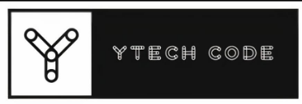

# YTechCode



YTech Code is a General Purpose Language (GPL) written on Python that runs over the Python Virtual Machine (PVM), taking advantage of its functioning but using a more structured syntax.

YTech Code aims to be a bridge language, with a more strict syntax than new programming languages but with all their advantages.

> **For more information about the syntax, capabilities and limitations visit the following [link](https://docs.google.com/presentation/d/1zxkYFwy2nthrWsdVpswIJLAEp7tq1e4L/edit?usp=sharing&ouid=106050235437320739420&rtpof=true&sd=true) with informative slides.** 

## Requirements

- Python 3 version <= 3.9.7
- Python 3 - gi
  
## Instructions

Install the required dependencies
```bash
$ pip install -r requirements.txt
```
YtechCode comes with two alternives to run code, YTechShell which is an interactive shell that runs statements and expressions in one line. It is meant to be used as a testing tool.
To initialize YtechShell run:
```bash
$ python3 YTechShell.py
```
YTech code comes with its own IDE with the following capabilities:

- Write multi-line programs without the need of ';' (it is needed in YTechShell)
- The IDE will search for files with the extension **ytc** and saved them with the same file extension.
- Run the programs and visualize the results or errors with the current date.
- Quick access to YTechShell.
  > The quick access to YTechShell is reserved for gnome-terminal and bash

To initialize the IDE run:

```bash
$ python3 IDE.py
```
The current version of YTechCode is 0.3.3, new versions will be released from the current repository.

